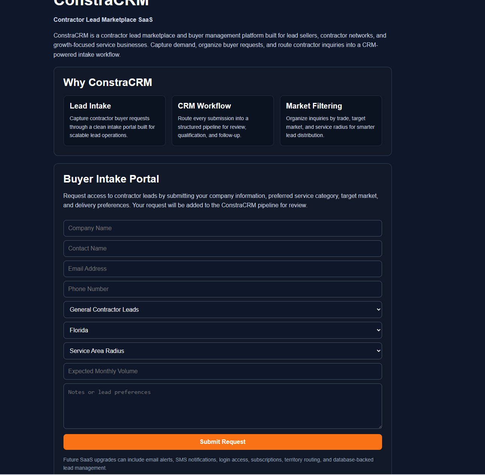
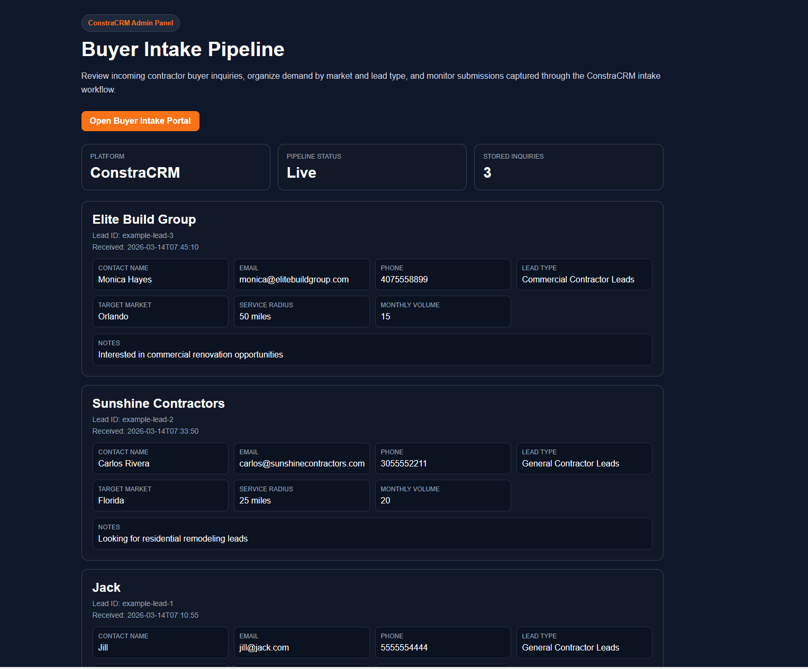

# ConstraCRM

ConstraCRM is a **Contractor Lead Marketplace SaaS Starter Platform** designed for lead sellers, contractor networks, and service marketplaces.

It provides a simple system for capturing contractor buyer inquiries, organizing demand by market and service category, and managing requests through a lightweight CRM intake workflow.

This project serves as a **minimum viable SaaS prototype** that can be expanded into a full lead marketplace platform.

---

## Platform Preview

### Buyer Intake Form


### CRM Dashboard


---

# Product Overview

ConstraCRM is designed as a **Contractor Lead Marketplace Starter Kit**.

This project can be used by:

- Lead generation agencies
- Contractor networks
- Marketing firms selling contractor leads
- Service marketplaces
- Growth agencies building CRM workflows

ConstraCRM captures buyer demand, organizes contractor lead requests, and routes inquiries into a lightweight CRM intake pipeline.

The platform is intentionally simple so it can be easily customized, expanded, or integrated into larger SaaS systems.

---

# Core Features

### Contractor Buyer Intake Portal
A clean web interface where contractors submit requests for lead access.

### FastAPI Backend API
Handles lead submissions, validation, and storage through REST endpoints.

### CRM Inquiry Pipeline
All submissions are stored and organized into a structured inquiry record.

### Admin Dashboard
A simple dashboard for viewing incoming contractor buyer inquiries.

### Market & Trade Filtering
Submissions capture service type, geographic market, and service radius.

---

# Technology Stack

- **Frontend:** HTML, CSS, JavaScript  
- **Backend:** FastAPI (Python)  
- **Data Storage:** JSON file (prototype storage)  
- **API Layer:** REST endpoints  
- **Dashboard:** Client-side rendering via API  

---

# Project Structure

ConstraCRM
│
├── backend
│ ├── main.py
│ └── buyer_inquiries.json
│
├── frontend
│ ├── index.html
│ └── dashboard.html
│
├── screenshots
│ ├── dashboard.png
│ └── index.png
│
└── README.md

---

# Running the Application

## 1. Start the backend server

Navigate to the backend directory and run:

```powershell
cd backend
python -m uvicorn main:app --reload
